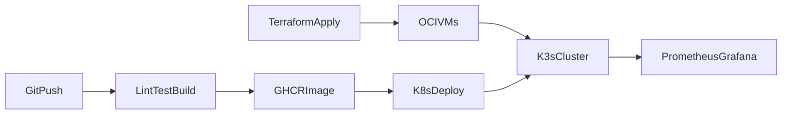

# Always-On Weather Dashboard

A small **Flask** service that exposes weather JSON from [OpenWeatherMap](https://openweathermap.org/api), packaged for a full **CI/CD → Docker → OCI → K3s → Prometheus/Grafana** learning path.

Design notes and pipeline breakdown live in [`markdown/`](markdown/):

- [`markdown/project_sketch.md`](markdown/project_sketch.md) — goals and roadmap  
- [`markdown/ci_cd_pipeline.md`](markdown/ci_cd_pipeline.md) — architecture and logical flow  
- [`markdown/weather_dashboard_chunks.md`](markdown/weather_dashboard_chunks.md) — 10-chunk map of this repo  

## What’s in this folder

| Path | Purpose |
|------|---------|
| [`app/`](app/) | Flask app (`app.py`), [`requirements.txt`](app/requirements.txt), [`tests/`](app/tests/) |
| [`Dockerfile`](Dockerfile) | Multi-stage image; Gunicorn on port **8080** |
| [`terraform/`](terraform/) | OCI VNC + 2× ARM nodes — see [`terraform/README.md`](terraform/README.md) |
| [`scripts/`](scripts/) | K3s bootstrap — see [`scripts/k3s-bootstrap.md`](scripts/k3s-bootstrap.md) |
| [`k8s/`](k8s/) | Deployment, Service, Ingress (Traefik), ServiceMonitor |
| [`observability/`](observability/) | Prometheus/Grafana notes + sample dashboard |

## End-to-end flow



1. **Pipeline** — lint, test, build image, push to GHCR (workflow at repo root: `.github/workflows/` when enabled).  
2. **Container** — `docker build` from this directory.  
3. **IaC** — `terraform apply` on Oracle Cloud (Always Free ARM).  
4. **Orchestration** — K3s + manifests in `k8s/`.  
5. **Observability** — `/metrics` in the app; stack in `observability/`.

## Prerequisites

- Python **3.12+** (or [uv](https://github.com/astral-sh/uv))  
- [OpenWeatherMap API key](https://openweathermap.org/api)  
- For later chunks: Docker, Terraform, `kubectl`, Helm, OCI API credentials  

## Local development (chunk 1)

### 1. Install dependencies

```bash
cd ci-cd/weather-dashboard
uv venv && uv pip install -r app/requirements.txt pytest ruff
```

### 2. Configure API key

The app reads **`OPENWEATHER_API_KEY`** from the environment (it does not load `.env` automatically).

```bash
export OPENWEATHER_API_KEY="your-key"
# optional
export WEATHER_CITY="London"
export WEATHER_UNITS="metric"
```

If your key is in the portfolio root `.env`:

```bash
set -a && source ../../.env && set +a
```

### 3. Run the dev server

From `ci-cd/weather-dashboard/app`:

```bash
uv run flask --app app run --host 0.0.0.0 --port 8080
```

Or with env file from repo root:

```bash
cd app
uv run --env-file ../../../.env flask --app app run --host 0.0.0.0 --port 8080
```

Open http://localhost:8080/

| Endpoint | Description |
|----------|-------------|
| `/` | HTML landing page |
| `/healthz` | Liveness JSON `{"status":"ok"}` |
| `/api/weather` | Weather JSON (needs API key) |
| `/metrics` | Prometheus metrics |

### 4. QA chunk 1

**Automated (chunk 2 gate):**

```bash
cd ci-cd/weather-dashboard
pytest -v app/tests/
ruff check app
```

**Manual smoke:**

```bash
curl -s http://localhost:8080/healthz
curl -s http://localhost:8080/api/weather
```

See [`markdown/weather_dashboard_chunks.md`](markdown/weather_dashboard_chunks.md) for the full 10-chunk checklist.

## Docker (chunk 3)

```bash
cd ci-cd/weather-dashboard
docker build -t weather-dashboard .
docker run --rm -p 8080:8080 \
  -e OPENWEATHER_API_KEY="your-key" \
  weather-dashboard
```

## Cloud and cluster (chunks 5–8)

1. **Terraform** — [`terraform/README.md`](terraform/README.md)  
2. **K3s** — [`scripts/k3s-bootstrap.md`](scripts/k3s-bootstrap.md)  
3. **Deploy** — create secret, then apply manifests:

```bash
kubectl create secret generic weather-openweather \
  --from-literal=OPENWEATHER_API_KEY="$OPENWEATHER_API_KEY"

kubectl apply -k k8s/
```

## Observability (chunks 9–10)

- App exposes Prometheus metrics at `/metrics`.  
- Install stack and import dashboard: [`observability/README.md`](observability/README.md).

## Implementation chunks (quick map)

| Chunk | Stage | Location |
|:-----:|-------|----------|
| 1 | Application source | `app/` |
| 2 | Tests / quality gate | `app/tests/`, `pyproject.toml` |
| 3 | Container image | `Dockerfile` |
| 4 | CI (lint, build, push) | `.github/workflows/` at **portfolio** repo root |
| 5 | IaC (OCI) | `terraform/` |
| 6 | K3s bootstrap | `scripts/` |
| 7 | Workload | `k8s/deployment.yaml`, `k8s/service.yaml` |
| 8 | Ingress | `k8s/ingress.yaml`, `k8s/kustomization.yaml` |
| 9 | Metrics wiring | `app/app.py`, `k8s/servicemonitor.yaml` |
| 10 | Dashboards | `observability/` |

## Security

- Do not commit `.env`, `*.pem`, or `*.tfstate*` (see [`.gitignore`](.gitignore)).  
- Use Kubernetes secrets or GitHub Actions secrets for production keys.  
- Restrict Terraform `admin_cidr` to your IP before `terraform apply`.

## Related docs

| Document | Topic |
|----------|--------|
| [`markdown/project_sketch.md`](markdown/project_sketch.md) | Project vision and Nate roadmap |
| [`markdown/ci_cd_pipeline.md`](markdown/ci_cd_pipeline.md) | Five pipeline components |
| [`markdown/weather_dashboard_chunks.md`](markdown/weather_dashboard_chunks.md) | Chunk-by-chunk repo map |
